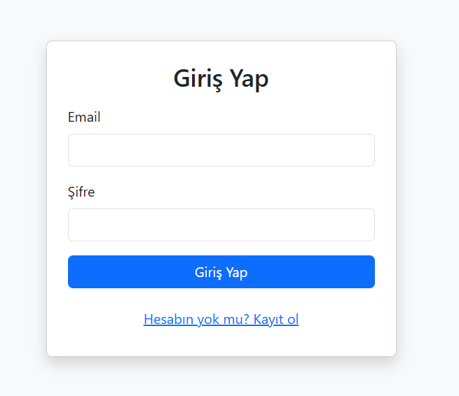
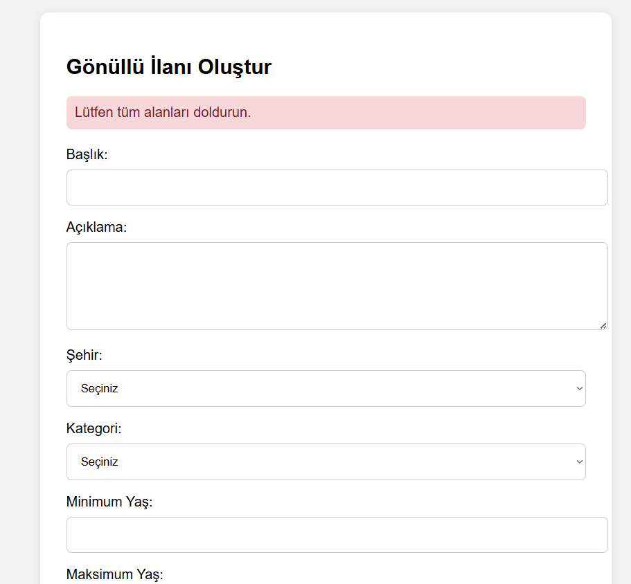
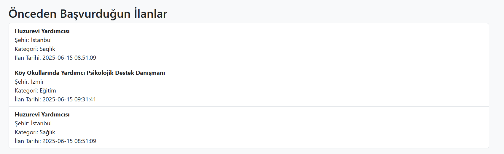
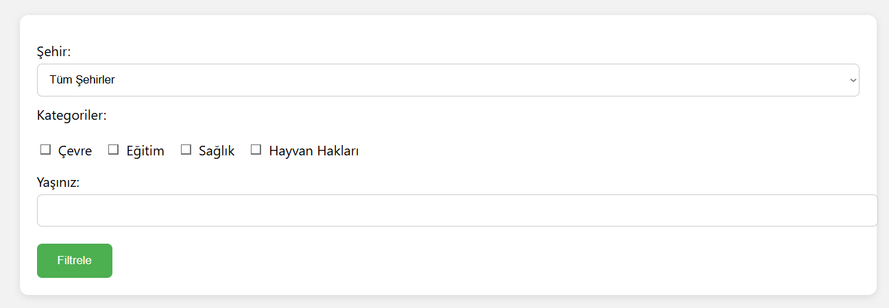

# 🌟 Gönüllülük ve Yardımlaşma Platformu

**Gönüllü Yönetim Sistemi**, PHP, MySQL ve Bootstrap kullanılarak geliştirilmiş bir **web uygulamasıdır**.  
Amacı, gönüllüleri ve gönüllü ilanlarını kolayca **yönetmek**, **takip etmek** ve **organize etmek** için sade ve etkili bir çözüm sunmaktır.

---

## 🚀 Temel Özellikler

- 🔐 **Kullanıcı Girişi & Oturum Yönetimi**
- 👤 **Profil Güncelleme:** Ad, yaş, şehir ve yetenekleri düzenleme
- 📝 **Gönüllü İlanları:** Oluşturma, düzenleme ve listeleme
- 🙋‍♂️ **Gönüllü Başvurusu:** Kullanıcılar ilanlara kolayca başvurabilir
- 📋 **Başvuru Takibi:** İlan sahipleri, gelen başvuruları görebilir
- 🌍 **Şehir & Kategori Bazlı Filtreleme:** İhtiyaca göre arama

---

## 📌 Sayfa Detayları

### 🔑 Kullanıcı Girişi
Kayıtlı kullanıcılar, `login.php` sayfasından sisteme giriş yapabilir.



### 👤 Profil Sayfası
Kullanıcılar bu sayfada:
- Bilgilerini (Ad, yaş, şehir, yetenekler) güncelleyebilir.
- Başvurduğu ilanları görebilir.
- Açtığı gönüllü ilanları ve bu ilanlara yapılan başvuruları listeleyebilir.

  



### 🙏 Gönüllü Ol Sayfası
- Şehir ve kategori bazında ilanları filtreleyebilir.
- Tüm açık gönüllü ilanları bu sayfada listelenir.



---

## 🛠 Kullanılan Teknolojiler

- **PHP 7+**
- **MySQL**
- **HTML & CSS (Bootstrap)**
- **JavaScript (opsiyonel)**
- **PDO (Güvenli Veritabanı İşlemleri)**

---
## 📁 Proje Dizini
```
proje/
├── aboutyou.php         
├── config.php            
├── index.php             
├── login.php              
├── logout.php            
├── register.php          
├── search.php             
├── update_profile.php    
├── volunteer.php         
├── volunteer_submit.php   
├── welcome.php                    

```
---
## ⚙ Kurulum Adımları

1️⃣ Bu projeyi bilgisayarınıza klonlayın:

```bash
git clone https://github.com/kullanici/volunteering-platform.git
```

2️⃣ `config.php` dosyasında veritabanı bilgilerinizi düzenleyin:

```php
$dsn = 'mysql:host=localhost;dbname=veritabani_adi;charset=utf8';
$username = 'db_kullanici';
$password = 'db_sifre';

$pdo = new PDO($dsn, $username, $password);
$pdo->setAttribute(PDO::ATTR_DEFAULT_FETCH_MODE, PDO::FETCH_ASSOC);
```

3️⃣ Projeyi Apache ya da Nginx'in ilgili dizinine taşıyın.

4️⃣ Tarayıcınızı açın ve aşağıdaki URL'ye gidin:

```
http://localhost/phpproje
```

## 📝 Linkler
- Web Sitesi: [Tıklayınız](http://95.130.171.20/~st23360859020/proje/index.php)
- Tanıtım Videosu Linki: [Tıklayınız](https://youtu.be/0rshWdZ-zQk)
- Kaynak Kodlar: [Tıklayınız](https://github.com/semaimre/volunteering-platform/blob/main/phpproje.zip)
- Sql Sorguları:[Tıklayınız](https://github.com/semaimre/volunteering-platform/blob/main/sorgular.sql)


---


